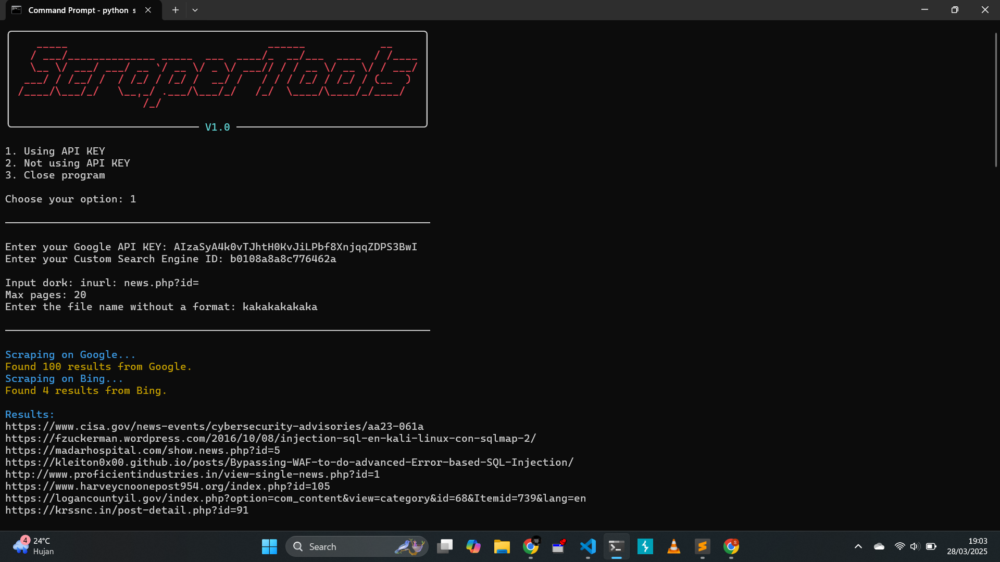
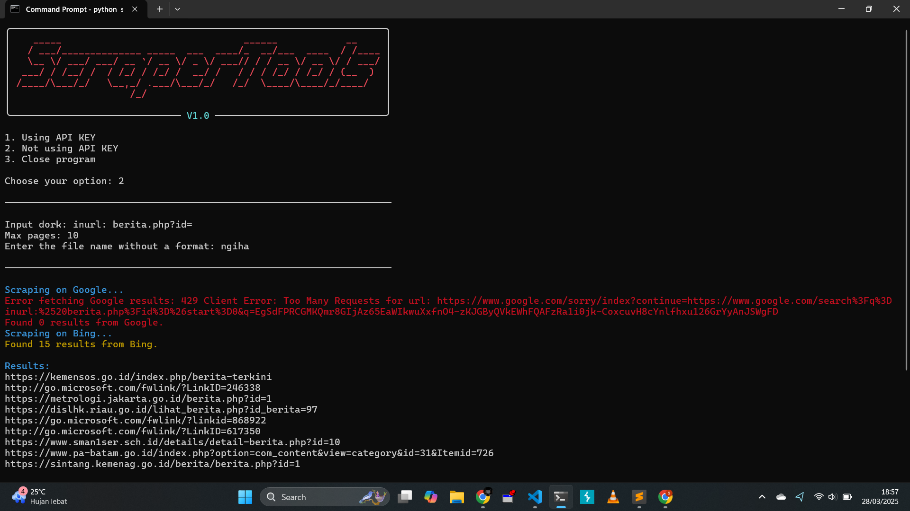

# ScraperTools

ScraperTools adalah alat pencarian otomatis yang memungkinkan pengguna untuk mengambil hasil pencarian dari beberapa mesin pencari seperti Google dan Bing. Program ini dapat berjalan dengan atau tanpa API KEY dan mendukung output yang disimpan dalam file. Alat ini bisa berguna untuk para Bug Hunter atau Pentester yang enggan mencari target dengan dorking manual.

## Fitur
- Mengambil hasil pencarian dari Google dan Bing
- Mode pencarian dengan atau tanpa API KEY
- Output hasil pencarian disimpan dalam file

## Persyaratan
Sebelum menjalankan ScraperTools, pastikan Anda telah menginstal dependensi yang diperlukan. Berikut adalah beberapa dependensi yang diperlukan :

```sh
requests
colorama
pyfiglet
beautifulsoup4
rich
```

## Instalasi
1. Clone repositori ini:
   ```sh
   git clone https://github.com/SuryoSC/scraperTools.git
   ```
2. Masuk ke direktori proyek:
   ```sh
   cd scraperTools
   ```
3. Instal dependensi:
   ```sh
   pip install -r requirements.txt
   ```

## Penggunaan
Jalankan program dengan perintah berikut:
```sh
python scraper.py
```

Kemudian pilih salah satu opsi yang tersedia:
1. **Using API KEY** - Memerlukan Google API KEY dan Custom Search Engine ID
2. **Not using API KEY** - Menggunakan scraping langsung tanpa API
3. **Close program** - Menutup program

## Menyimpan Hasil
Hasil scraping akan disimpan dalam folder `Result/` dengan nama file yang telah ditentukan oleh pengguna.

## Struktur Proyek
```
ScraperTools/
│── scraper.py        # Program utama
│── requirements.txt  # Daftar dependensi
│── README.md         # Dokumentasi proyek
│── Result/           # Folder untuk menyimpan hasil scraping
│── Screenshot/       # Folder untuk menyimpan screenshot tampilan aplikasi
```

## Screenshot
ScraperTools Using API KEY:



ScraperTools Not using API KEY:



---
Dibuat dengan sepenuh hati oleh **Suryo Saputro**

